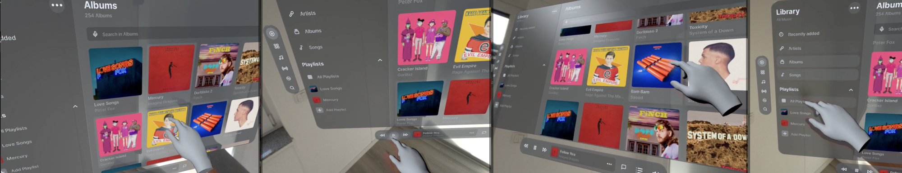
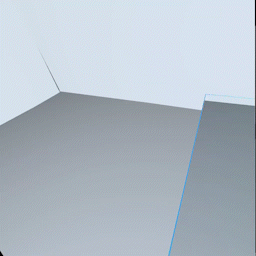

# @coconut-xr/natuerlich

_WebXR Interaction for Three.js_

This library builds on [Three.js](https://github.com/mrdoob/three.js) (open-source WebGL library) and [WebXR](https://immersiveweb.dev/) (Web Standard for Augmented and Virtual Reality) to deliver **composable and extensible interactions for immersive experiences** .

We provide bindings to [react-three/fiber](https://github.com/pmndrs/react-three-fiber), enabling a **familiar Developer Experience** for react developers.

`npm install @coconut-xr/natuerlich`

⤷[ Getting Started](https://coconut-xr.github.io/natuerlich/#/getting-started)

## Examples

- [Spatial UI with Koestlich](https://codesandbox.io/s/natuerlich-spatual-ui-example-xmdpvq?file=/src/app.tsx)

    

- [Placing Objects](https://codesandbox.io/s/natuerlich-placing-objects-3q74pk?file=/src/app.tsx) - 3D Models from [Quaternius](https://quaternius.com/)

    

- [Rag Doll Physics](https://codesandbox.io/s/natuerlich-ragdoll-physics-j2q7mc?file=/src/App.js) - based on [R3F Example](https://codesandbox.io/s/wdzv4)

    

## [Documentation](https://coconut-xr.github.io/natuerlich)

- [Getting Started](https://coconut-xr.github.io/natuerlich/#/getting-started) - barebones WebXR, Hands, and Controllers

    

- [Interaction with Objects](https://coconut-xr.github.io/natuerlich/#/object-interaction) - build interactions with objects

    

- [Interaction with Koestlich](https://coconut-xr.github.io/natuerlich/#/koestlich-interaction) - build interactive 3D UIs

    

- [Teleport](https://coconut-xr.github.io/natuerlich/#/teleport) - building a teleport interaction

    

- [Poses](https://coconut-xr.github.io/natuerlich/#/poses) - detecting and generating hand poses

    

- [Layers](https://coconut-xr.github.io/natuerlich/#/layers) - high quality content using WebXR layers

    

- [Anchors](https://coconut-xr.github.io/natuerlich/#/anchors) - spatial anchors using WebXR anchors

    

- [Tracked Planes](https://coconut-xr.github.io/natuerlich/#/planes) - tracked room planes using WebXR planes

    

- [Head Up Display](https://coconut-xr.github.io/natuerlich/#/head-up-display) - placing content in front of the user's camera

    

- [Custom Input Sources](https://coconut-xr.github.io/natuerlich/#/custom-input-sources) - building custom interactive hands and controllers

    

- [Tracked Images](https://coconut-xr.github.io/natuerlich/#/images) - image marker tracking using WebXR Image Tracking
- [Guards](https://coconut-xr.github.io/natuerlich/#/guards) - conditional rendering using guards
- [Use XR](https://coconut-xr.github.io/natuerlich/#/use-xr) - accessing the raw XR state
- [Configuration](https://coconut-xr.github.io/natuerlich/#/configuration) - configurating foveation, frameRate, referenceSpace, and frameBufferScaling
---

- [All Components](https://coconut-xr.github.io/natuerlich/#/all-components) - API Documentation for all available components
- [All Hooks](https://coconut-xr.github.io/natuerlich/#/all-hooks) - API Documentation for all available hooks

## Ecosystem

- User Interfaces - [@coconut-xr/koestlich](https://github.com/coconut-xr/koestlich)
- Pre-designed UI Components - [@coconut-xr/apfel-kruemel](https://github.com/coconut-xr/apfel-kruemel)

## Acknowledgements

This library is only possible because of the great efforts from the [Immersive Web Community Group and Immersive Web Working Group at the W3C](https://github.com/immersive-web), the [Three.js](https://github.com/mrdoob/three.js) team, and the [react-three-fiber](https://github.com/pmndrs/react-three-fiber) team. This work is inspired by existing libraries, such as [react-xr](https://github.com/pmndrs/react-xr) and [handy-work](https://github.com/AdaRoseCannon/handy-work).

**natuerlich** is funded by [Coconut Captial](https://coconut.capital/)
