# @coconut-xr/natuerlich

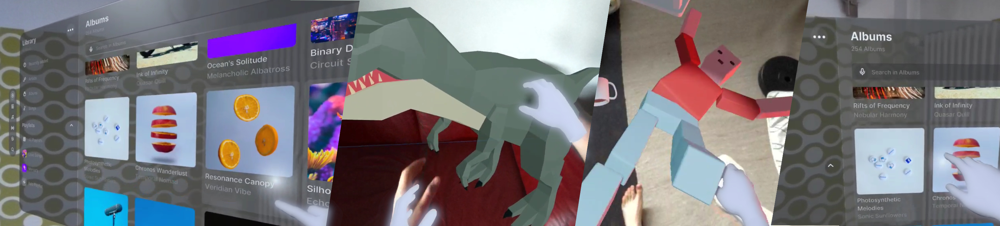

_WebXR Interaction for Three.js_

This library builds on [Three.js](https://github.com/mrdoob/three.js) (open-source WebGL library) and [WebXR](https://immersiveweb.dev/) (Web Standard for Augmented and Virtual Reality) to deliver **composable and extensible interactions for immersive experiences** .

We provide bindings to [react-three/fiber](https://github.com/pmndrs/react-three-fiber), enabling a **familiar Developer Experience** for react developers.

`npm install @coconut-xr/natuerlich`

## Check out the [Getting Started](getting-started)

## Examples

- [Spatial UI with Koestlich](https://codesandbox.io/s/natuerlich-spatual-ui-example-xmdpvq?file=/src/app.tsx)

    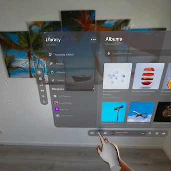

- [Placing Objects](https://codesandbox.io/s/natuerlich-placing-objects-3q74pk?file=/src/app.tsx) - 3D Models from [Quaternius](https://quaternius.com/)

    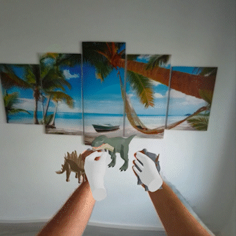

- [Rag Doll Physics](https://codesandbox.io/s/natuerlich-ragdoll-physics-j2q7mc?file=/src/App.js) - based on [R3F Example](https://codesandbox.io/s/wdzv4)

    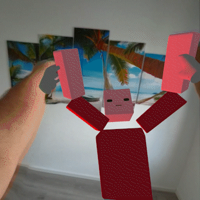

## [Documentation](https://coconut-xr.github.io/natuerlich)

- <a href="https://coconut-xr.github.io/natuerlich/getting-started">Getting Started - barebones WebXR, Hands, and Controllers  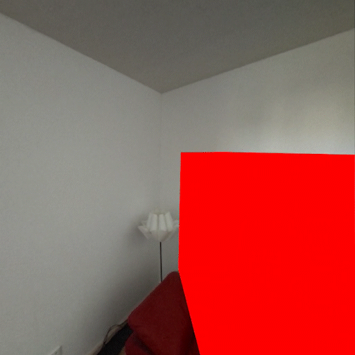</a>

- <a href="https://coconut-xr.github.io/natuerlich/object-interaction">Interaction with Objects - build interactions with objects  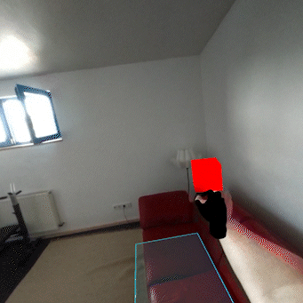</a>

- <a href="https://coconut-xr.github.io/natuerlich/koestlich-interaction">Interaction with Koestlich - build interactive 3D UIs  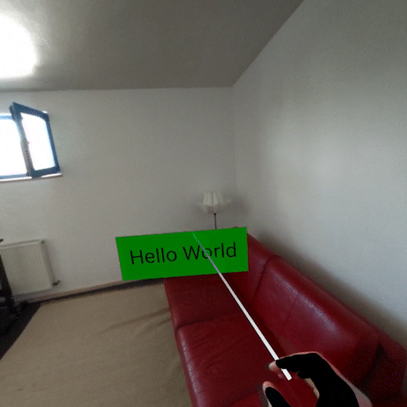</a>

- <a href="https://coconut-xr.github.io/natuerlich/teleport">Teleport - building a teleport interaction  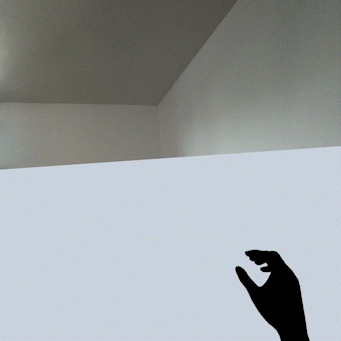</a>

- <a href="https://coconut-xr.github.io/natuerlich/poses">Poses - detecting and generating hand poses  </a>

- <a href="https://coconut-xr.github.io/natuerlich/layers">Layers - high quality content using WebXR layers  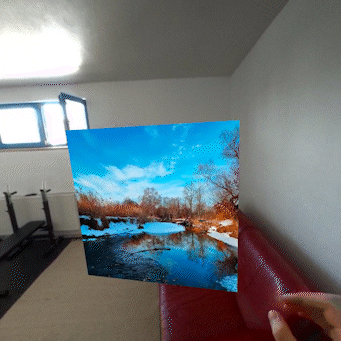</a>

- <a href="https://coconut-xr.github.io/natuerlich/anchors">Anchors - spatial anchors using WebXR anchors  </a>

- <a href="https://coconut-xr.github.io/natuerlich/tracked-planes">Tracked Planes - tracked room planes using WebXR planes  </a>

- <a href="https://coconut-xr.github.io/natuerlich/head-up-display">Head Up Display - placing content in front of the user's camera  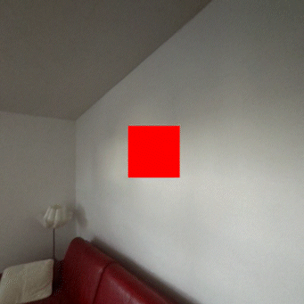</a>

- <a href="https://coconut-xr.github.io/natuerlich/custom-input-sources">Custom Input Sources - building custom interactive hands and controllers  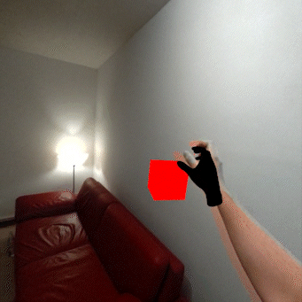</a>

- <a href="https://coconut-xr.github.io/natuerlich/images">Tracked Images - image marker tracking using WebXR Image Tracking</a>

- <a href="https://coconut-xr.github.io/natuerlich/guards">Guards - conditional rendering using guards</a>

- <a href="https://coconut-xr.github.io/natuerlich/use-xr">Use XR - accessing the raw XR state</a>

- <a href="https://coconut-xr.github.io/natuerlich/configuration">Configuration - configurating foveation, frameRate, referenceSpace, and frameBufferScaling</a>

---

- <a href="https://coconut-xr.github.io/natuerlich/all-components">All Components - API Documentation for all available components</a>

- <a href="https://coconut-xr.github.io/natuerlich/all-hooks">All Hooks - API Documentation for all available hooks</a>

## Acknowledgements

This library is only possible because of the great efforts from the [Immersive Web Community Group and Immersive Web Working Group at the W3C](https://github.com/immersive-web), the [Three.js](https://github.com/mrdoob/three.js) team, and the [react-three-fiber](https://github.com/pmndrs/react-three-fiber) team. This work is inspired by existing libraries, such as [react-xr](https://github.com/pmndrs/react-xr) and [handy-work](https://github.com/AdaRoseCannon/handy-work).

**natuerlich** is funded by [Coconut Capital](https://coconut.capital/)
