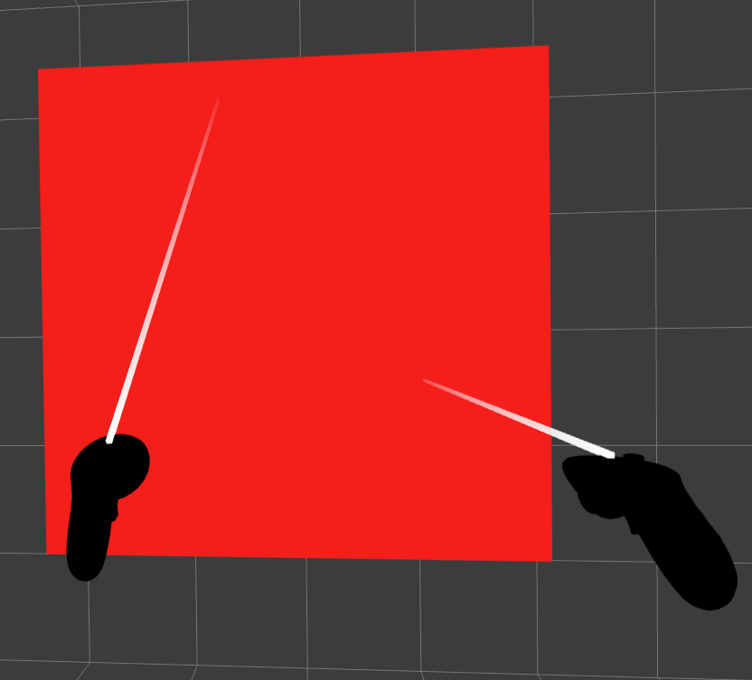

# Getting Started

In the following tutorials, we will create several WebXR Experiences using **natuerlich** and react-three/fiber. Install the dependencies manually via `npm i @coconut-xr/natuerlich @react-three/fiber react react-dom three zustand three-stdlib` or use the CodeSandbox provided for each example. When developing locally, ensure you host your code using HTTPS, which is required for WebXR sessions.

_Make sure your three.js version is either lower or higher than 0.0.153._

**If you have questions or get stuck, jump into our [Discord](https://discord.gg/NCYM8ujndE).**

## Bare-bones WebXR Experience

Creating the bare minimum for a WebXR experience using **natuerlich** only requires the `useEnterXR` hook to create an Enter Button and the `XRCanvas`. The `XRCanvas` allows to configure WebXR features, such as foveation, frameRate, referenceSpace, and frameBufferScaling via corresponding optional properties.

In the following example, we additionally use the `NonImmersiveCamera` to control the position of the camera when not in VR/AR. We also use the `ImmersiveSessionOrigin` to control the position of the immersive origin (your feet) in AR/VR.

As a result, in the following example, users are positioned in front of the red cube regardless of whether they are in AR/VR or not.

[CodeSandbox](https://codesandbox.io/s/natuerlich-barebones-xmdpvq)

_TODO: exchange AR image_

| Without AR                                                             | Inside AR                                                       |
| ---------------------------------------------------------------------- | --------------------------------------------------------------- |
|  |  |

```tsx
import { XRCanvas } from "@coconut-xr/natuerlich/defaults";
import {
  useEnterXR,
  NonImmersiveCamera,
  ImmersiveSessionOrigin
} from "@coconut-xr/natuerlich/react";

const sessionOptions: XRSessionInit = {
  requiredFeatures: ["local-floor"]
};

export default function Index() {
  const enterAR = useEnterXR("immersive-ar", sessionOptions);
  return (
    <div
      style={{...}}
    >
      <button onClick={enterAR}>Enter AR</button>
      <XRCanvas>
        <mesh position={[0, 1.5, 1]}>
          <boxGeometry />
          <meshBasicMaterial color="red" />
        </mesh>
        <NonImmersiveCamera position={[0, 1.5, 4]} />
        <ImmersiveSessionOrigin position={[0, 0, 4]} />
      </XRCanvas>
    </div>
  );
}
```

<details>
  <summary>In Depth Explanation</summary>

Instead of directly using the XRCanvas, the underlying `<XR/>` component can be used to add WebXR support to a scene. The `XR` component allows to change the foveation, frameRate, referenceSpace, and frameBufferScaling.

In addition to adding the `XR`, the event system needs to be overwritten since **natuerlich** uses [xinteraction](https://github.com/coconut-xr/xinteraction). Therefore, the events inside the canvas need to be disabled via `elements={noEvents}`. To enable interaction using normal mouse and touch controls, we are adding the `XWebPointers` from [xinteraction](https://github.com/coconut-xr/xinteraction). The `XRCanvas` automatically applies these changes.

The following code shows how to manually apply, add the `XR` component and exchange the event system.

[CodeSandbox](https://codesandbox.io/s/natuerlich-barebones-manual-dg2q8r)

```tsx
import { Canvas } from "@react-three/fiber";
import { XWebPointers } from "@coconut-xr/xinteraction/react";
import { useEnterXR, XR } from "@coconut-xr/natuerlich/react";

const sessionOptions: XRSessionInit = {
  requiredFeatures: ["local-floor"]
};

export default function Index() {
  const enterAR = useEnterXR("immersive-ar", sessionOptions);
  return (
    <div
      style={{...}}
    >
      <button onClick={enterAR}>Enter AR</button>
      <Canvas>
        <XR />
        <XWebPointers />
      </Canvas>
    </div>
  );
}

```

</details>

## Adding Controllers and Hands

**natuerlich** provides the `useInputSources` hook for adding controller and hand support. Each `inputSource` represents one hand or controller. Developers can map each `inputSource` to a custom hand or controller implementation. **natuerlich** provides high and low-level components that simplify the creation of custom controllers and hands. For instance, the `GrabHand`, `TouchHand`, `Pointerhand`, `GrabController`, and `PointerController` components provide hands and controllers for the most common interaction types and visualizations. If your use case requires different interactions or visualizations, read our [introduction to custom input devices](./custom-input.md) for more information.

In the following example, we extend the previous code and add the default `PointerHand`s and `PointerController`s to the scene. Using `inputSources.map`, we map each controller/hand to its implementation. This allows developers to provide different implementations based on the `inputSource.handedness`. We can differentiate between hands and controllers based on the existence of the `hand` property on the `inputSource`.

The following code also shows how to use the maximum available framerate and frameBufferScaling using the `useFramRates` and `useNativeFramebufferScaling` hooks.
To demonstrate interactivity, we also add a `Grabbable` component around the red cube, which allows grabbing the cube and even scaling it using two hands/controllers.

#### Important:

All objects tracked using WebXR, such as the controllers and hands, must be placed inside the `ImmersiveSessionOrigin`.
For using hands inside a WebXR session, the `"hand-tracking"` feature needs to be requested inside the `sessionOptions`.

_TODO: exchange AR image_

[CodeSandbox](https://codesandbox.io/s/natuerlich-hands-controllers-wthf4v?file=/src/app.tsx)



```tsx
import {
  XRCanvas,
  PointerHand,
  PointerController,
  Grabbable
} from "@coconut-xr/natuerlich/defaults";
import { getInputSourceId } from "@coconut-xr/natuerlich";
import {
  useEnterXR,
  NonImmersiveCamera,
  ImmersiveSessionOrigin,
  useInputSources
} from "@coconut-xr/natuerlich/react";

const sessionOptions: XRSessionInit = {
  requiredFeatures: ["local-floor", "hand-tracking"]
};

export default function Index() {
  const enterAR = useEnterXR("immersive-ar", sessionOptions);
  const inputSources = useInputSources();
  return (
    <div
      style={{...}}
    >
      <button onClick={enterAR}>Enter AR</button>
      <XRCanvas>
        <Grabbable position={[0, 1.5, 1]}>
          <mesh>
            <boxGeometry />
            <meshBasicMaterial color="red" />
          </mesh>
        </Grabbable>
        <NonImmersiveCamera position={[0, 1.5, 4]} />
        <ImmersiveSessionOrigin position={[0, 0, 4]}>
          {inputSources.map((inputSource) =>
            inputSource.hand != null ? (
              <PointerHand
                id={getInputSourceId(inputSource)}
                key={getInputSourceId(inputSource)}
                inputSource={inputSource}
                hand={inputSource.hand}
              />
            ) : (
              <PointerController
                id={getInputSourceId(inputSource)}
                key={getInputSourceId(inputSource)}
                inputSource={inputSource}
              />
            )
          )}
        </ImmersiveSessionOrigin>
      </XRCanvas>
    </div>
  );
}

```

## Next Up

With this bare-bones setup, you are ready to use all features **natuerlich** has to offer. The following list contains an unordered list of features and their documentation.

- [Interaction with Objects](./object-interaction.md) - build interactions with objects
- [Interaction with Koestlich](./koestlich-interaction.md) - build interactive 3D UIs
- [Teleport](./teleport.md) - building a teleport interaction
- [Poses](./poses.md) - detecting and generating hand poses
- [Guards](./guards.md) - conditional rendering using guards
- [Layers](./layers.md) - high quality content using WebXR layers
- [Anchors](./anchors.md) - spatial anchors using WebXR anchors
- [Tracked Planes](./planes.md) - tracked room planes using WebXR planes
- [Tracked Images](./images.md) - image marker tracking using WebXR Image Tracking
- [Custom Input Devices](./custom-input.md) - building custom interactive hands and controllers
- [Use XR](./use-xr.md) - accessing the raw XR state

---

If your questions were not yet answered, visit our [Discord](https://discord.gg/NCYM8ujndE) ;)
